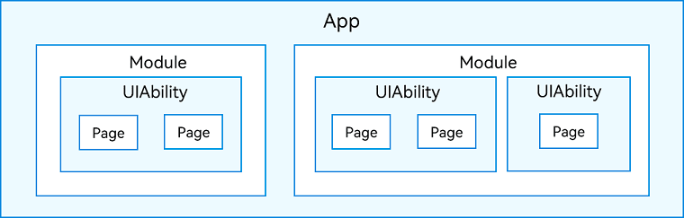

# 鸿蒙技术
## 工程结构介绍
* AppScope > app.json5：应用的全局配置信息。 
* src > main > ets：用于存放ArkTS源码。 
* src > main > ets > entryability：应用/服务的入口。 
* src > main > ets > pages：应用/服务包含的页面。 
* src > main > resources：用于存放应用/服务所用到的资源文件，如图形、多媒体、字符串、布局文件等。关于资源文件，[详见资源分类与访问](https://developer.huawei.com/consumer/cn/doc/harmonyos-guides-V2/resource-categories-and-access-0000001544463977-V2)。 
* src > main > module.json5：Stage模型模块配置文件。主要包含HAP包的配置信息、应用/服务在具体设备上的配置信息以及应用/服务的全局配置信息。具体的配置文件说明，[详见module.json5配置文件](https://developer.huawei.com/consumer/cn/doc/harmonyos-guides-V2/module-configuration-file-0000001427744540-V2)。 
* build-profile.json5：当前的模块信息、编译信息配置项，包括buildOption、targets配置等。其中targets中可配置当前运行环境，默认为HarmonyOS。 
* hvigorfile.ts：模块级编译构建任务脚本，开发者可以自定义相关任务和代码实现 
## Stage模型应用程序包结构
在开发态，一个应用包含一个或者多个Module,可以在IDE中创建一个或者多个Module,Module是HarmoneyOS应用/服务的基本功能单元，其包含了源代码，资源文件，第三方库及应用/服务配置文件，每一个Module都可以独立进行变异和运行。
Module分为"Ability"和"Library"二种类型，“Ability”类型Module对应与编译后的HAP(Harmoney Ability Package);"Library"类型的Module对应HAR(Harmony Archive),或者
HSP(Harmony Shared Package).
一个Module可以包含一个或多个UIAbility组件

* 开发者通过DevEco Studio把应用程序编译为一个或者多个.hap后缀的文件，即HAP。HAP是HarmonyOS应用安装的基本单位，包含了编译后的代码、资源、三方库及配置文件。HAP可分为Entry和Feature两种类型。
  * Entry类型的HAP：是应用的主模块，在[module.json5配置](https://developer.huawei.com/consumer/cn/doc/harmonyos-guides-V2/module-configuration-file-0000001427744540-V2)文件中的type标签配置为“entry”类型。在同一个应用中，同一设备类型只支持一个Entry类型的HAP，通常用于实现应用的入口界面、入口图标、主特性功能等。
* 每个HarmonyOS应用可以包含多个.hap文件，一个应用中的.hap文件合在一起称为一个Bundle，而bundleName就是应用的唯一标识[请参见app.json5配置](https://developer.huawei.com/consumer/cn/doc/harmonyos-guides-V2/app-configuration-file-0000001427584584-V2)文件中的bundleName标签）。需要特别说明的是：在应用上架到应用市场时，需要把应用包含的所有.hap文件（即Bundle）打包为一个.app后缀的文件用于上架，这个.app文件称为App Pack（Application Package），其中同时包含了描述App Pack属性的pack.info文件；在云端（服务器）分发和终端设备安装时，都是以HAP为单位进行分发和安装的。
## 关键字介绍
* @Component
装饰的自定义组件
* @Entry
定义为入口
* @State
改变组件状态
* @prop
父组件单向同步的场景
* @Link
与父组件双向同步状态和监听状态变化
* @Watch
与父组件双向同步状态和监听状态变化
* @Provide，@Consume
跨组件层级双向同步状态
* @Builder
Builder装饰器,装饰函数，快速生成布局内容，从而可以避免重复的UI描述内容。
* this关键字
* Observed

引用当前类定义的参数

## 组件介绍
* ForEach
[ForEach循环渲染](https://developer.huawei.com/consumer/cn/doc/harmonyos-guides-V2/arkts-rendering-control-foreach-0000001524537153-V2)
* tabs
* VideoPlayer
[ViewPlayer使用说明文档](https://developer.huawei.com/consumer/cn/training/course/slightMooc/C101680765314766141)
* Swiper

## 网络框架使用

## 动画
[鸿蒙动画](https://developer.huawei.com/consumer/cn/doc/harmonyos-guides-V2/arkts-animation-overview-0000001450755570-V2)
* 显示动画
* 属性动画
###
疑问
# import { CommonConstant as Const, ContentType } from '../CommonConstants';和 import { CommonConstant as Const, ContentType } from '../CommonConstants';区别

### UiAbility
1. UiAility是一种包含用户界面的应用组件，用于和用户进行交互UiAbility是系统调度的单元，提供窗口用于界面绘制
2. UiAbility的创建和对应页面的创建
3. UiAbility内页面间的跳转
4. UiAbility的创建，前后台切换，销毁的生命周期状态